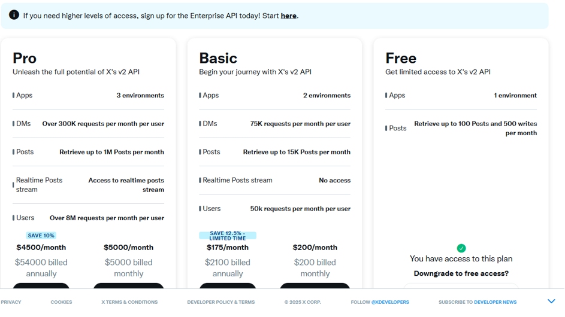
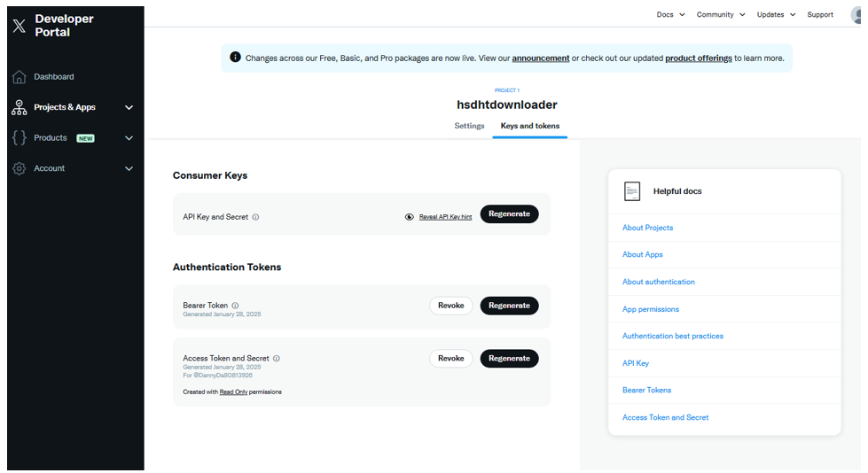
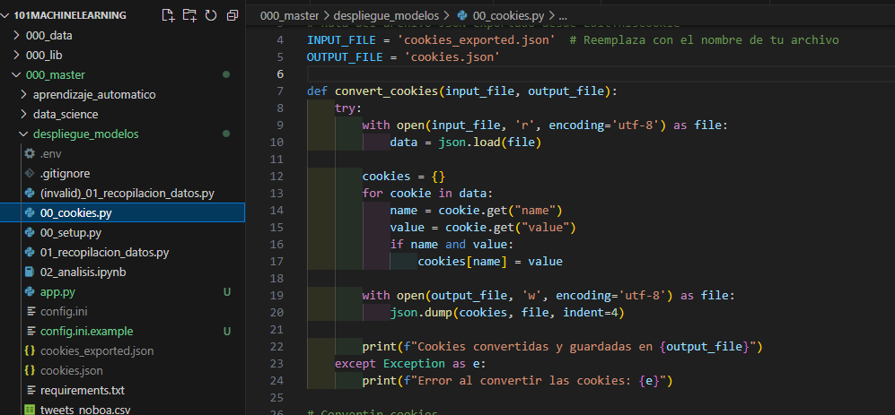
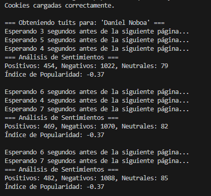
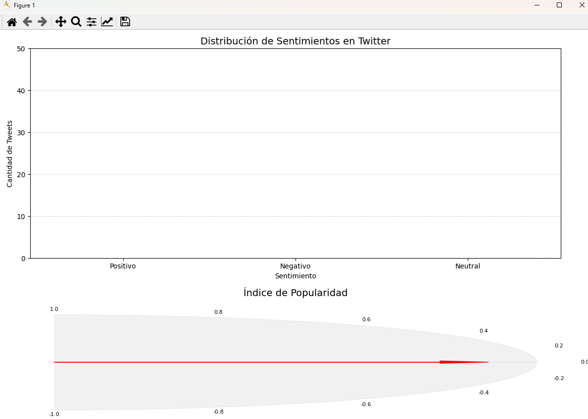
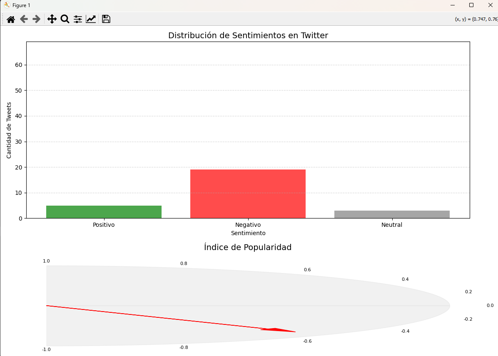
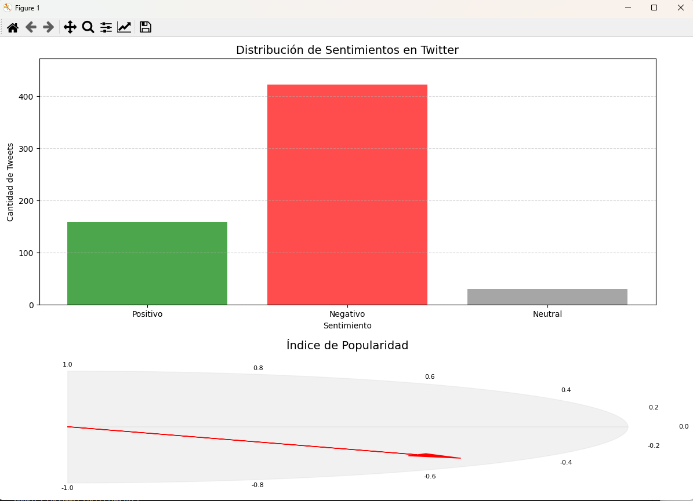

# **Análisis de Sentimientos en Twitter en Tiempo Real**

Este proyecto es una herramienta integral para recolectar, analizar y visualizar tweets en tiempo real. Utiliza tecnologías avanzadas como `twikit` para scraping de Twitter y modelos preentrenados de `transformers` para análisis de sentimientos. La visualización de los datos se realiza dinámicamente a través de gráficos claros y atractivos. Este enfoque permite evaluar opiniones públicas sobre temas específicos con un flujo constante y eficiente.

---

## **Por qué se eligió `twikit` en lugar del API de Twitter**

### **Limitaciones del API Oficial de Twitter**
El API oficial de Twitter tiene las siguientes desventajas significativas:
1. **Restricción en el número de resultados**:
   - Permite un máximo de 100 tweets por solicitud, lo cual no es ideal para análisis masivos o en tiempo real.
   - Para obtener más datos, es necesario escalar a versiones pagas que incrementan costos de forma significativa.

2. **Datos incompletos**:
   - Los tweets obtenidos suelen estar truncados si contienen enlaces largos, menciones o contenido multimedia, lo que limita el alcance y precisión del análisis de sentimientos.

3. **Costos elevados**:
   - Las versiones del API con acceso extendido tienen precios altos y aún mantienen restricciones de uso en cuanto a la frecuencia de solicitudes y el volumen de datos.



---

### **Ventajas de `twikit`**
1. **Acceso sin restricciones**:
   - `twikit` utiliza técnicas de scraping directo desde la interfaz web de Twitter, permitiendo obtener una mayor cantidad de datos sin las limitaciones impuestas por el API.

2. **Datos completos y enriquecidos**:
   - Los tweets incluyen texto completo, metadatos relevantes y datos adicionales que pueden ser útiles para análisis más detallados.

3. **Eficiencia para experimentos en tiempo real**:
   - Permite recolectar datos continuamente con mayor frecuencia, ideal para casos de uso dinámicos como eventos en curso o análisis de tendencias.



---

## **Características del Proyecto**

1. **Recolección de tweets en tiempo real**:
   - Se utiliza `twikit` para buscar y recolectar tweets relacionados con palabras clave predefinidas.
   - Los datos recolectados incluyen texto del tweet, usuario, métricas de interacción (retweets, favoritos) y marcas temporales.
   - Estos datos se almacenan en un archivo CSV (`tweets_noboa.csv`), asegurando persistencia y fácil reutilización.

2. **Análisis de sentimientos**:
   - Utiliza el modelo preentrenado `nlptown/bert-base-multilingual-uncased-sentiment` de la librería `transformers` para clasificar los tweets en:
     - Positivos
     - Negativos
     - Neutrales
   - Este modelo es un ejemplo de transfer learning, ajustado para múltiples idiomas y específicamente diseñado para tareas de análisis de sentimientos.
   - Los resultados del análisis se almacenan en otro archivo CSV (`tweets_sentimiento.csv`), junto con los datos originales de los tweets.

   #### **Consideraciones sobre `transformers`**:
   - **Preentrenamiento**: Los modelos en `transformers` como BERT están preentrenados en grandes cantidades de texto, lo que los hace altamente efectivos para tareas de NLP.
   - **Uso de GPU**: Si se dispone de una GPU, el análisis se acelera significativamente. En caso contrario, el modelo utiliza la CPU.
   - **Límite de caracteres**: Debido a la arquitectura de BERT, los textos deben limitarse a 512 caracteres. El código se encarga de realizar este ajuste automáticamente.

3. **Visualización dinámica**:
   - Se utiliza `matplotlib` para generar gráficos en tiempo real. Incluye:
     - Un gráfico de barras para la distribución de sentimientos (positivo, negativo y neutral).
     - Un gráfico tipo gauge que muestra el índice de popularidad, calculado como la diferencia proporcional entre tweets positivos y negativos.

---

## **Guía de Ejecución**

### 1. **Exportar Cookies desde Twitter**
Para autenticar las solicitudes, es necesario exportar las cookies de sesión desde Twitter. Utiliza la extensión **EditThisCookie** para este propósito. 
1. Abre la página de Twitter.
2. Exporta las cookies y guárdalas en un archivo llamado `cookies_exported.json`.


---

### 2. **Convertir las Cookies al Formato Correcto**
El script `00_cookies.py` transforma las cookies exportadas al formato requerido por `twikit`. Para ejecutar el script, usa el siguiente comando:

```bash
python 00_cookies.py
```

El resultado será un archivo `cookies.json`, que se usará para autenticar las solicitudes.



---

### 3. **Ejecución del Proyecto**
Ejecuta el script principal `app.py` para iniciar la recolección y análisis de tweets:

```bash
python app.py
```

#### **Procesos realizados**:
1. Recolecta tweets en tiempo real con base en las palabras clave.
2. Almacena los resultados en `tweets_noboa.csv`.
3. Aplica análisis de sentimientos, cuyos resultados se almacenan en `tweets_sentimiento.csv`.
4. Muestra gráficos dinámicos con los datos procesados.



---

### 4. **Gráfica de Sentimientos en Tiempo Real**
El programa genera:
1. **Gráfica de barras**: Representa la distribución de sentimientos (positivo, negativo y neutral).
2. **Gauge**: Muestra el índice de popularidad, que varía entre -1 (predominio negativo) y 1 (predominio positivo).

Corte 1:

Corte 2:

Corte 3:


---

## **Requisitos Previos**

### **Dependencias**
El proyecto utiliza las siguientes librerías:
- `pandas`: Para manipulación de datos.
- `matplotlib`: Para visualización gráfica.
- `torch`: Backend para modelos de `transformers`.
- `transformers`: Librería de modelos preentrenados para tareas de NLP.
- `twikit`: Para scraping de datos de Twitter.

Instala las dependencias con:
```bash
pip install -r requirements.txt
```

### **Configuración de Credenciales**
Crea un archivo `config.ini` con tus credenciales de Twitter. Este archivo será utilizado para autenticar las solicitudes:
```ini
[X]
username = "TU_USERNAME"
email = "TU_EMAIL"
password = "TU_PASSWORD"
```

---

## **Estructura del Proyecto**

```
📂 TWEETSSENTIMENT
├── docs/
│   ├── 00_cookies_edit.png          # Imagen de exportar cookies
│   ├── 01_cookies_transformation.png # Imagen de transformación de cookies
│   ├── 02_ejecucion_consola_real_time.png # Consola de ejecución
│   ├── 03_grafica_realtime.png      # Gráfica dinámica de sentimientos
│   ├── 05_x_portal.png              # Portal de Twikit
│   └── 06_prices_restrictions.png   # Precios y restricciones del API de Twitter
├── app.py                           # Script principal
├── 00_cookies.py                    # Conversión de cookies
├── config.ini                       # Credenciales del usuario
├── requirements.txt                 # Dependencias del proyecto
├── tweets_noboa.csv                 # Tweets recolectados
├── tweets_sentimiento.csv           # Tweets analizados
```

---

## **Consideraciones**

1. **Límites de Scraping**:
   - Aunque `twikit` evita restricciones severas, realiza solicitudes de manera escalonada para prevenir bloqueos.

2. **Rendimiento**:
   - Se recomienda usar una GPU para acelerar el análisis de sentimientos con `transformers`.

3. **Visualización en tiempo real**:
   - La visualización dinámica asegura que los nuevos datos sean incorporados en cada actualización.

4. **Persistencia de Datos**:
   - Los tweets procesados se guardan para evitar duplicados en futuras ejecuciones.

---